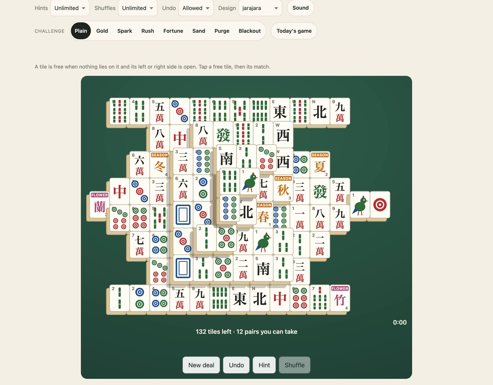
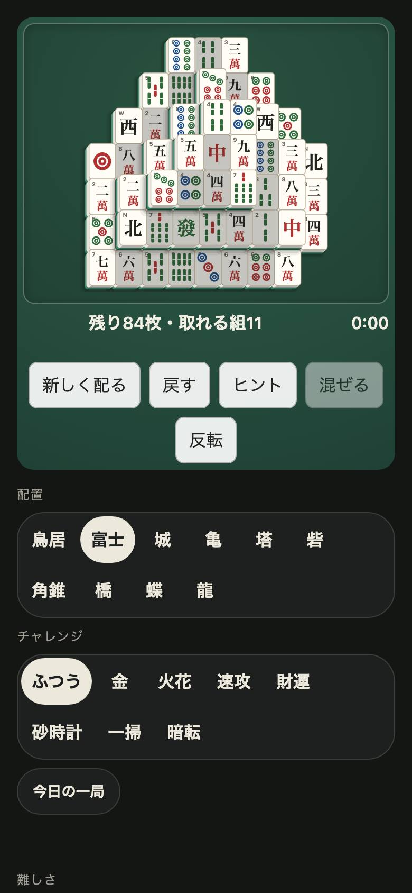

<h1 align="center">Jarajara <sub>ジャラジャラ</sub></h1>

<p align="center"><strong>Mahjong tiles for JavaScript and TypeScript.</strong><br>
The 144-tile set in 42 faces, drawn as SVG, with backs and cloths; custom elements for one tile, a rack, a layout to play, a table and viewers of the set; the stacked layouts tile games are played on; which tiles are free, which match, dealing and shuffling; a game written as text; and Awase, the matching solitaire, alone or at a table of two to four with a computer player. Seeded, and every deal can be cleared. No dependencies.</p>

<p align="center">
  <a href="https://github.com/johnmorrisdotca/jarajara/actions/workflows/ci.yml"></a>
  <a href="https://www.npmjs.com/package/@johnmorrisdotca/jarajara"></a>
  <a href="./LICENSE"></a>
  
</p>

<p align="center"><a href="https://johnmorrisdotca.github.io/jarajara/"><strong>Play Awase →</strong></a> · <a href="https://johnmorrisdotca.github.io/jarajara/api.html">API reference</a></p>

<p align="center">
  
  
</p>

Jarajara is the tiles; the games are played on them. The first is **Awase**
(合わせ), the matching solitaire many know as Mahjong Solitaire or Shanghai:
take the tiles away two at a time, two that match and that are both free,
until the layout is clear. It is played at
[itsutsu.com](https://itsutsu.com/games/mahjong), which this package was taken
out of, and in [the demo](https://johnmorrisdotca.github.io/jarajara/), with
nothing to install.

## In 30 seconds

```sh
npm install @johnmorrisdotca/jarajara
```

```ts
import { canTake, freePairs, geometryOf, isCleared, layoutFor, takePair } from "@johnmorrisdotca/jarajara";
import { checkAwase, generateAwase } from "@johnmorrisdotca/jarajara/awase";
import { layoutSvg } from "@johnmorrisdotca/jarajara/faces";

const deal = generateAwase(15, "medium", 12345);   // the Turtle, 144 tiles, from seed 12345
const geometry = geometryOf(layoutFor(15)!);       // what stands on and beside every slot, worked out once

let cells = deal.givens;                           // a face letter a slot, "." for one taken
const [a, b] = freePairs(geometry, cells, "group")[0]!;
if (canTake(geometry, cells, "group", a, b)) cells = takePair(cells, a, b);

document.querySelector("#board")!.innerHTML = layoutSvg(15, cells, { showFree: true })!;
isCleared(cells);                                  // not yet
checkAwase(15, deal.givens, deal.solution);        // { ok: true }: the deal's own answer clears it
```

## Who it is for

- **Game sites and apps** that want tiles with the rules already right: a
  deal everybody plays alike from a seed, a finished game a server can check
  by playing it, and the faces drawn as text that goes into any page.
- **Anyone making a tile game of their own**, who wants the set, the free
  rule, the layouts and the drawing, and to write only the game.

## The tiles

Three suits of nine, characters 萬子, circles 筒子 and bamboo 索子, four of
each; the four winds and the three dragons, four of each; and one each of the
four flowers and the four seasons. 144 tiles in 42 faces, each written as one
letter so a whole layout is a string:

| Letters | Faces |
| --- | --- |
| `a`–`i` | characters 1–9 |
| `j`–`r` | circles 1–9 |
| `s`–`A` | bamboo 1–9 |
| `B`–`E` | east, south, west, north winds |
| `F`–`H` | red, green, white dragons |
| `I`–`L` | plum, orchid, chrysanthemum, bamboo (flowers) |
| `M`–`P` | spring, summer, autumn, winter (seasons) |

Two tiles match when they are the same face. The flowers and seasons match in
one of two ways, the bonus rule: `group`, the usual, where any flower takes any
flower and any season any season, or `same`, where only an identical tile
does and the deal holds them in identical pairs.

A tile is **free** when nothing lies on it and it has an open side, left or
right. Only free tiles may be taken.

## The layouts

| Size | Name | Tiles | Layers |
| --- | --- | --- | --- |
| 4 | Tiny | 8 | 3 |
| 8 | Torii | 64 | 3 |
| 9 | Fuji | 100 | 5 |
| 10 | Castle | 120 | 5 |
| 15 | Turtle | 144 | 5 |

The Turtle is the layout the solitaire has been played on since it was first
published. A layout's size is its width in tiles, and names it. Tiny is for
tests, cleared in four pairs.

## Awase

```ts
import { checkAwase, freshAwaseSeed, generateAwase } from "@johnmorrisdotca/jarajara/awase";
```

A deal is laid in reverse, pair by pair onto slots that would be free, so
**every deal can be cleared**. Its level is how forgiving it is: five deals are
laid from the seed and each played out by a player taking any free pair at
random; `easy` is the one that player clears most often, `hard` the one it
clears least. When no pair is left, the tiles still on the layout may be
shuffled where they lie, drawn from the deal so a replay draws the same.

A solve is written as text: each pair its two slots in base 36 (`"0a1c"`), a
shuffle `*`. `checkAwase` plays it on the deal and asks that the layout ends
empty: a few thousand steps, no search, safe to run on a server.

## Awase at a table

```ts
import { computerPair, playAtTable, readTable, startTable } from "@johnmorrisdotca/jarajara/table";

let table = startTable(generateAwase(15, "medium", 7), [{ name: "Ann" }, { name: "Computer", computer: true }]);
const pair = computerPair(table)!;                 // the computer's choice for whoever is to move
table = playAtTable(table, pair[0], pair[1])!.table;
readTable(table);                                  // whose turn, the scores, the pairs taken, whether it is over
```

Two to four players share one layout and take turns, each taking one free
pair. Every pair scores: the plain suit tiles one, the ones and nines two, a
wind three, a dragon four, and a flower or season pair two and another turn.
When the player to move has no pair, the tiles are shuffled and they go on.
Most points when the layout is cleared wins. Everything is face up, so one
device can be passed round with no cover screen.

## Drawing

```ts
import { layoutSvg, tileSvg, tileFaceSymbols, TILE_INK } from "@johnmorrisdotca/jarajara/faces";

tileSvg("F");                                      // one tile, the red dragon, as a whole <svg>
layoutSvg(15, cells, { chosen: 12, showFree: true }); // a layout, stacked, far to near, the chosen tile ringed
```

The faces are a Japanese-style set in plain strokes that read at thirty
pixels: numerals over a red 萬, dots and sticks counted out, the winds and
dragons as their characters, and every suit tile and wind with its number or
letter small in the corner for a reader who does not count dots at a glance or
read 東 as east. Strings, not components, so they go into any page or
framework. Every tile in a layout is a `<g>` with `data-slot`, `data-face`
and `data-free` for a page to listen on. The colours are fixed, since tiles are
light objects on any table; the table under them is the page's.

Backs, designs and cloths are drawn the same way:

```ts
import { tileBackSvg, layoutSvg, clothVars, JARAJARA_CLOTHS } from "@johnmorrisdotca/jarajara/faces";

tileBackSvg("bamboo");                                    // jade, bamboo, blue, red and ink
tileBackSvg("ink", { colour: "#336699", mark: "SITE" });  // recoloured, with a few letters across it
layoutSvg(15, cells, { cloth: "wood", hideBlocked: true }); // a felt behind it; blocked tiles drawn blank
clothVars("blue");                                        // the felt as CSS custom properties
```

`layoutSvg` also takes `matching` (slots ringed), `marked` (slots given a gold mark), `design`, `redFives`, and
`symbols: false` for a page that draws a board again and again and keeps the faces' symbols once.

## Elements

Seven custom elements put the tiles on any page, with no framework. Load them once and write the tags:

```html
<script type="module" src="https://cdn.jsdelivr.net/npm/@johnmorrisdotca/jarajara@1/dist/element-define.js"></script>

<jarajara-tile code="east" size="large" flip></jarajara-tile>
<jarajara-rack tiles="234m567p3456s11z77z" pick capacity="14"></jarajara-rack>
<jarajara-layout size="15" controls timer show-free cloth="green"></jarajara-layout>
```

Or `import "@johnmorrisdotca/jarajara/element/define"` in a bundle; `@johnmorrisdotca/jarajara/element` holds the classes alone, to extend or to define under other names. Importing either on a server is safe. Tiles and boards are never text-selectable, every element keeps one steady box, and each speaks English or Japanese (its own `lang`, or the page's, and it follows a language chooser).

| Element | What it is |
| --- | --- |
| `<jarajara-tile code="F">` | One tile, face up or down, any design and back, turned by a tap with `flip`; `size` `small` / `medium` / `large` or a `width`; `marked`; `spin()` |
| `<jarajara-rack tiles="…">` | Tiles lined up in front of you: `hide()`, `show()`, `toggle(tiles?)`, `sort(order?)`, `group("suit" \| "kind")`, `ungroup()`, `unsort()`, `mixUp(seed?)`, `take(tile)`, `add(tile, at?)`, `replace()`, `lift()`, `lower()`, `mark()`, `unmark()`, `spin()`; a tap raises a tile with `pick` |
| `<jarajara-layout size="15">` | A game of Awase to play on a stacked layout: free tiles, pick two to take, hint, shuffle, undo, a timer, limits on hints and shuffles, matching tiles ringed, and the same layout lined up sorted by x, y and z |
| `<jarajara-table players="3">` | Awase at a table of two to four, with computers in the seats that are not people's |
| `<jarajara-viewer query="east">` | A tile looked up by its code, a name in English or Japanese, or hand notation, with what it is |
| `<jarajara-group group="winds">` | A group of the set shown: a suit, `honours`, `bonus`, `terminals`, `simples`, … |
| `<jarajara-set>` | The whole set as an inventory: 42 faces and their counts, or all 144 tiles; given `tiles`, it counts what a hand holds |

Tiles in a rack are named by their place as written (`0`, `3`) when a method wants one tile, or by a letter or name (`"F"`, `"east"`) for every tile of that face. A rack keeps the room of its widest arrangement, so grouping, sorting and closing the groups never change its size, and `capacity` keeps it the size of that many tiles however many it holds. Every change is a bubbling event: `jarajara-rack`, `jarajara-pick`, `jarajara-take`, `jarajara-flip`, and for a layout `jarajara-take`, `jarajara-shuffle`, `jarajara-stuck`, `jarajara-clear`, `jarajara-hint`, `jarajara-undo`, `jarajara-deal`.

`<jarajara-layout>` attributes: `size`, `level` (`easy`, `medium`, `hard`), `seed`, `cells` (a position of your own), `show-free`, `show-matching`, `hints` and `shuffles` (a number, `off` or `unlimited`), `undo="off"`, `timer`, `controls`, `view="lined"` with `sort="z y x"` (any of `x`, `y`, `z`, a `-` before one for the other way round), `static`, `cloth`, `design`, `lang`. `restore(moves)` plays a kept game back on the deal.

A table, a rack, a layout, a group, a set and a viewer all take `cloth`: `green`, `blue`, `red`, `black` or `wood`, the family's five, which a page can follow from the demo header's `family-cloth` event.

## Looking tiles up

```ts
import { findFace, findFaces, readTiles, writeNotation, setInventory, groupFaces, tileName } from "@johnmorrisdotca/jarajara";

findFace("three circles")?.code;     // "l"
findFace("三筒")?.code;              // "l"
findFace("7z")?.code;                // "F", the red dragon, in the notation riichi hands are written in
readTiles("123m456p east plum");     // ["a","b","c","m","n","o","B","I"]
writeNotation(["a", "b", "c", "B"]); // "123m1z"
tileName("B", "ja");                 // "東"
setInventory();                      // 42 faces, each with how many of it the 144 tiles hold
```

The notation is `123m` characters, `123p` circles, `123s` bamboo, `1z`–`4z` the winds and `5z`–`7z` white, green and red dragons, and Jarajara's own `1f` flowers and `1t` seasons. `0m`, `0p` and `0s` read as fives.

## Sorting and grouping tiles

```ts
import { arrangeTiles, groupTiles, mixTiles, sortSlots, readSlotKeys } from "@johnmorrisdotca/jarajara";

arrangeTiles(hand, "suit");          // "suit", "rank", "kind", "code" or "dealt"
groupTiles(hand, "kind");            // [numbers, honours, bonus tiles]
mixTiles(hand, 42);                  // another order, the same one for the same seed
sortSlots(layout, ["-z", "x", "y"]); // a layout's slots from the top of the stacks, then across
```

## API

The [API reference](https://johnmorrisdotca.github.io/jarajara/api.html) lists every export of every entry point with its signature and its doc comment. It is made from the source by `pnpm site`, so it cannot fall behind the code.

| Import | What it holds |
| --- | --- |
| `@johnmorrisdotca/jarajara` | the set (`MAHJONG_FACES`, `faceOf`, `tilesMatch`, `matchClass`, `bonusRuleOf`, `setPairs`, `pairPoints`), names and lookup (`faceWords`, `tileName`, `findFace`, `findFaces`, `readTiles`, `writeTiles`, `readNotation`, `writeNotation`, `TILE_GROUPS`, `groupFaces`, `setInventory`, `copiesOf`, `countTiles`), arranging (`arrangeTiles`, `arrangeIndexes`, `groupTiles`, `mixTiles`, `sortSlots`, `readSlotKeys`, `describeSlot`), the layouts (`MAHJONG_LAYOUTS`, `layoutFor`, `layoutExtent`), the board (`geometryOf`, `isFree`, `freeSlots`, `freePairs`, `blockedBy`, `canTake`, `takePair`, `tilesLeft`, `isCleared`), dealing (`layPairs`, `pairsLeft`, `shuffleTiles`), games as text (`encodeMoves`, `decodeMoves`, `playSolve`, `dealFits`), `seededRandom` and `shuffled` |
| `@johnmorrisdotca/jarajara/awase` | `generateAwase(size, level, seed)`, `checkAwase(size, givens, answer)`, `freshAwaseSeed(rule)`, `bonusRuleOfSeed`, `clearRate` |
| `@johnmorrisdotca/jarajara/table` | `startTable`, `readTable`, `tablePairs`, `playAtTable`, `takeAtTable`, `undoAtTable`, `computerPair`, `encodeTable`, `decodeTable`, `seatName`, `SEAT_WINDS` |
| `@johnmorrisdotca/jarajara/faces` | `tileSvg`, `tileFaceSvg`, `tileFaceSymbols`, `faceWords`, `layoutSvg`, `layoutBox`, `tileAt`, the backs (`tileBackSvg`, `tileBackFace`, `TILE_BACKS`), designs (`jarajaraDesign`, `loadTileDesign`, `TILE_DESIGNS`, `redFiveIndexes`), cloths (`JARAJARA_CLOTHS`, `CLOTHS`, `isCloth`, `clothVars`), and the colours `TILE_INK`, `TILE_BODY`, `TILE_MARKS` |
| `@johnmorrisdotca/jarajara/element` | the element classes (`JarajaraTile`, `JarajaraRack`, `JarajaraLayout`, `JarajaraTable`, `JarajaraGroup`, `JarajaraSet`, `JarajaraViewer`), `hintPair`, `rackPlaces`, `rackWidth`, `ELEMENT_SIZES` |
| `@johnmorrisdotca/jarajara/element/define` | defines the seven tags on the page, for its effect |

Every function is pure: it returns new values and never changes what it was
given.

## Architecture

The rules are plain functions over strings, with no DOM; the drawing is a
separate entry, so a server that only checks a game never loads it.

```text
src/
├── index.ts          the main entry: the set, layouts, board, dealing, moves, names and arranging
├── awase-entry.ts    the "/awase" entry: the solitaire's deal and check
├── table-entry.ts    the "/table" entry: Awase for two to four, and the computer
├── faces-entry.ts    the "/faces" entry: the tiles, backs, designs and layouts drawn as SVG
├── element.ts        the "/element" entry: the custom element classes
├── element-define.ts the "/element/define" entry: defines the tags on the page
├── tiles.ts          the 144 tiles in 42 faces, matching, and what a pair scores
├── names.ts          what each tile is called in English and Japanese, finding one by name, hand notation
├── arrange.ts        sorting, grouping and mixing tiles; putting a layout's slots in order by x, y, z
├── layouts.ts        the five stacked layouts, Tiny to the Turtle
├── board.ts          which tiles are free, the pairs that can be taken, taking one
├── deal.ts           laying pairs in reverse so a deal can always be cleared; shuffling
├── moves.ts          a game written as text, and played back on a deal
├── awase.ts          a deal of Awase from a seed, at three levels
├── check.ts          whether a finished game clears its deal
├── table.ts          the rules at a table: turns, scores, shuffles and the end
├── computer.ts       the computer's choice of pair at the table
├── faces.ts          each face as SVG text, one tile on its own, and their colours
├── backs.ts          the backs of the tiles as SVG
├── designs.ts        the designs a tile may be drawn in, and the red fives
├── design.types.ts   the type of a set of drawn tiles
├── cloth.ts          the family's five cloths
├── draw.ts           a whole layout drawn as one SVG, stacked far to near
├── random.ts         the seeded random numbers every deal is made from
├── types.ts          the types of the set, layouts, moves and Awase
├── table.types.ts    the types of a table
├── version.ts        the package's version
└── ui/
    ├── elementKit.ts     what the elements share: designs, backs, language, cloth, marks, spin
    ├── strings.ts        the words the elements say, in English and Japanese
    ├── tileElement.ts    <jarajara-tile>
    ├── rackElement.ts    <jarajara-rack>
    ├── rackLayout.ts     where tiles lie in a rack
    ├── layoutElement.ts  <jarajara-layout>
    ├── tableElement.ts   <jarajara-table>
    └── viewerElements.ts <jarajara-viewer>, <jarajara-group> and <jarajara-set>
```

Tests sit beside the code they test (`*.test.ts`). `site.fixture.json` holds
every deal and table game itsutsu.com made before the move, played again on
every build. `demo/` is the playable page, `e2e/` its browser tests (`pnpm test:demo`), and `scripts/` builds it and its API reference page and checks
the package as npm packs it.

## The name

*Jarajara* (ジャラジャラ) is the sound of mahjong tiles being shuffled, the
rattle of a hundred and forty-four of them washed together face down on the
table before a game. It is said in four beats, *ja-ra-ja-ra*. *Awase* (合わせ)
is "matching", "putting together", from *awaseru* (合わせる), to join two
things into a pair.

## Development

```sh
pnpm install
pnpm check          # lint, types and every test, every recorded deal made again
pnpm test:package   # pack, install and import it as somebody who installed it would
pnpm site           # build the demo into site/, as the Pages workflow publishes it
pnpm test:demo      # build it and run the browser tests of the elements and the page
```

## Licence

MIT, © John Morris. The tile faces are drawn for this package and are under
the same licence.
